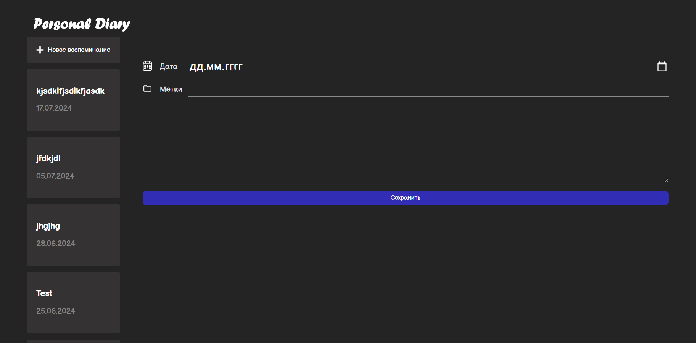

# Personal Diary

A small project to practice basic React skills.

## Preview



## Technologies

- **React**
- **TypeScript**
- **Vite**
- **SCSS**

## Architecture

```
src/
├── components/             # Reusable components
│   ├── Buttons/            # Button components
│   ├── Fields/             # Input and Textarea fields
│   ├── Form/               # Form component
│   ├── Header/             # Header component
│   ├── List/               # List component
│   ├── ListItem/           # List item component
│   └── Toggle/             # Toggle switch component
│
├── hooks/                  # Custom hooks
├── layout/                 # Layout components
│   ├── BaseLayout/         # Base layout
│   ├── Content/            # Content layout
│   └── LeftPanel/          # Left panel layout
│
├── providers/              # Context providers
├── types/                  # TypeScript types
└── main.tsx                # Application entry point
```

## Development

```bash
# Install dependencies
yarn install

# Start development server
yarn dev

# Build the project
yarn build

# Run linter
yarn lint

# Run preview
yarn preview
```
